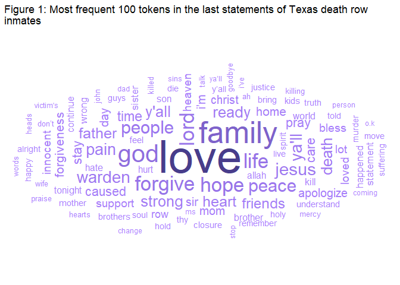
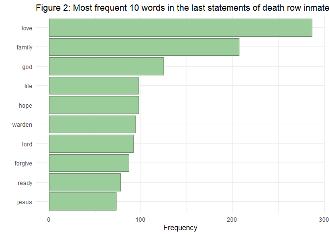
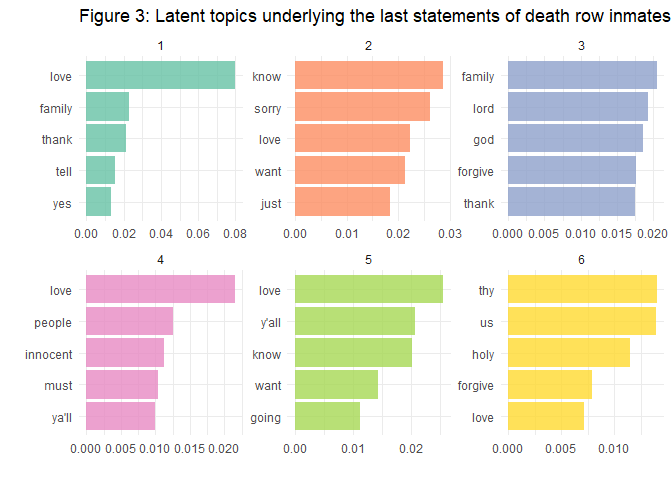
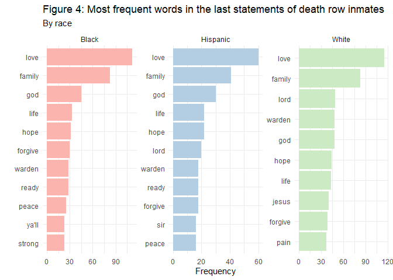
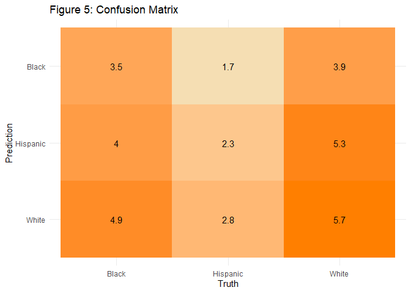
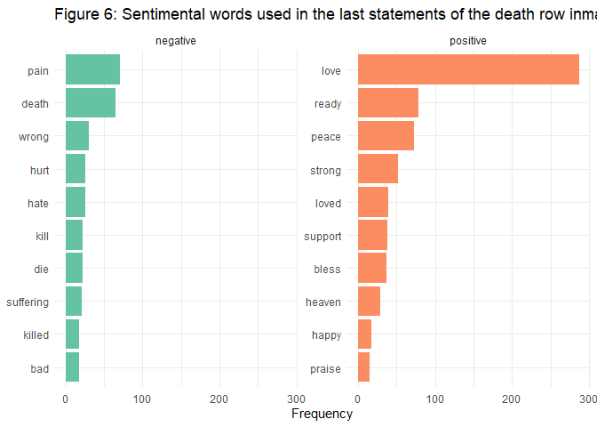
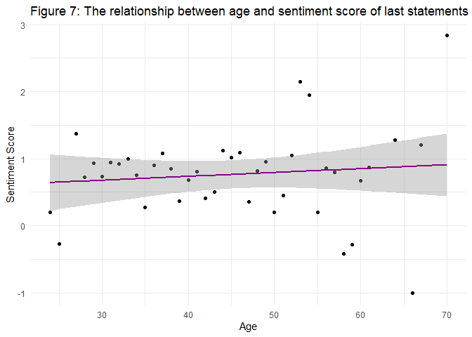

Last Statements by Texas Death Row Inmates
================
Zeynep Aslan

-   [Overview](#overview)
    -   [Most frequent words](#most-frequent-words)
        -   [Topic Modeling](#topic-modeling)
    -   [Most Frequent Words by Race](#most-frequent-words-by-race)
        -   [Predictive Modeling](#predictive-modeling)
    -   [Sentiment Analyses](#sentiment-analyses)

<!-- IMPORTANT: To be able to reproduce this report, you need the death_row.csv data. Use Data_Scraping.R file to generate this data before trying to reproduce this report.
-->

# Overview

This report analyses the [last statements of Texas death row
inmates](https://www.tdcj.texas.gov/death_row/dr_executed_offenders.html).
Specifically, this report examines the last words of the inmates to
reveal the common topics underlying their statements and to explore
overall emotional tone of these statements. The report also includes
specific analyses looking at the relationship between the inmates’ last
statements and their demographic information, such as race and age.

## Most frequent words

Before getting into more detailed analyses, let’s check first the most
frequent words used by the inmates in their last statements.

The word cloud in Figure 1 demonstrates 100 most frequent words used by
the Texas death row inmates in their last statements. Darker colors and
bigger fonts suggest higher frequency. Looking at the graph, we can see
that the word “Love” appears most frequently in the last statements of
inmates.

Similar to Figure 1, Figure 2 shows the most frequent 10 words used in
the last statements of Texas death row inmates. Even from this
preliminary analysis, we can observe some clear patterns: Most inmates
use their last statements as a chance to express their *love* for their
*families* and friends and seek *forgiveness* for their crimes by
turning to *religion*.

### Topic Modeling

Now, let’s apply *topic modeling* to the data to uncover the potential
themes underlying the last statements of the inmates.

<!-- -->

Figure 3 shows 6 potential topics underlying the last statements of the
death row inmates. All 6 topics look pretty much the same, there are no
clear patterns that can differentiate the topics from each other. 5 out
of 6 topics include the word *love* (topics 1, 2, 4, 5, and 6) and half
of the topics reveal the remorse of the inmate with the words *sorry*
and *forgive* (topics 2, 3, and 6). Some of the topics also include
religious references such as words *holy* and *god* (topics 3 and 6). It
is important to note that the topics does not become any more
distinguishable/interpretable by increasing or decreasing the number of
models specified in model structure.

## Most Frequent Words by Race

In this part of the report, we will analyze whether or not we can
estimate the races of inmates depending on their last statements. Before
running a predictive model to test this question, let’s check the most
frequent words used by inmates of each race.

Figure 4 demonstrates the most frequent words used by inmates of
different races in their last statements. When we compare the graphs, we
can see that there is a great deal of consistency between race groups in
terms of the themes of the last statements: As also shown in Figure 1
and 2, inmates of all races express their love for their families and
ask for forgiveness from the God in their last statements.

### Predictive Modeling

Now, let’s estimate a *random forest model* with 10-folds
cross-validation to test if we can predict the race of an inmate based
purely on their last statements.

<table>
<caption>
Table 1: Random Forest Model (10-folds)
</caption>
<thead>
<tr>
<th style="text-align:center;">
Metric
</th>
<th style="text-align:center;">
Estimator
</th>
<th style="text-align:center;">
Mean
</th>
<th style="text-align:center;">
n
</th>
<th style="text-align:center;">
Standard Error
</th>
</tr>
</thead>
<tbody>
<tr>
<td style="text-align:center;">
accuracy
</td>
<td style="text-align:center;">
multiclass
</td>
<td style="text-align:center;">
0.34
</td>
<td style="text-align:center;">
10
</td>
<td style="text-align:center;">
0.02
</td>
</tr>
</tbody>
</table>

<!-- -->

Table 1 shows the performance of the model. The average accuracy of the
model was 34%, which is not great at all. Confusion matrix also displays
the sub-optimal performance of the model. We can see that the model most
accurately predicts the races of White individuals but even that
performance is very bad. Overall, the results of the predictive model
suggests that the last statements of inmates do not carry much
informative value about the races of their speakers.

## Sentiment Analyses

Finally, let’s estimate the sentiment of the last statements of the
death row inmates.

<!-- -->

Figure 6 demonstrates the top 10 most frequently used positive and
negative words in the last statements of the death row inmates. The last
statements of the inmates generally have a positive rather than negative
tone. This is interesting and quite tragic, considering that these words
were uttered by people who were in the last few minutes of their lives.
However, when positive words are examined more closely, it can be
understood where this positivity stems from: It seems like inmates made
peace with the fact that their lives were about to end and they were
ready to pass to the ‘other side’. On another note, the word ***love***
outweighs in the last statements of inmates (i.e., more than half of the
inmates who made a statement articulated the word *love* in their
statements) and this is because inmates also use their last statements
to express their love for their families who were there for their
execution.

<!-- -->

Lastly, Figure 7 demonstrates the relationship between the ages of the
inmates at the time of their execution and the sentiment level of their
last statements. The sentiment level of each word in a last statement is
coded using the
[AFINN](https://search.r-project.org/CRAN/refmans/textdata/html/lexicon_afinn.html)
dataset. AFINN is a lexicon of English words rated for valence with a
range between -5 (negative) to 5 (positive). As can be seen from Figure
1, across all ages, the last statements of the inmates are slightly
positive. However, there seems to be no relationship between inmates’
ages and the sentiment level of their last statements.
